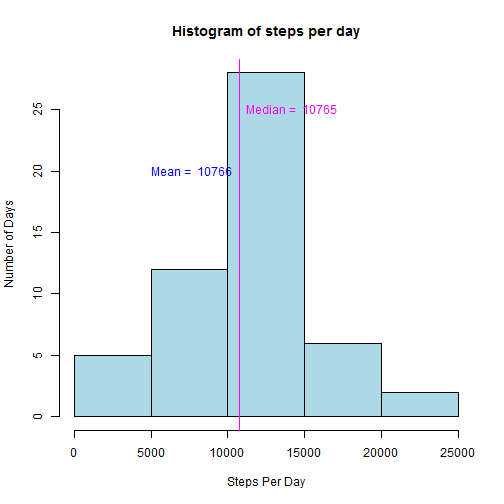

##Introduction  

This assignment will read data obtained from an activity monitoring device and
answer a set of questions provided. The data is provided in the file "activity.csv"
and this script assumes that "activity.csv" file is located in the same
directory where the markdown script is located. The questions posed as part of
the assignment are

1. What is mean total number of steps taken per day?
2. What is the average daily activity pattern ?
3. Impute missing values and devise a strategy for the filling in missing values
4. Depict differences in activity patterns between weekdays and weekends

### Loading Activity.csv file

```r
# Load the activity.csv file. 
# Key Assumption: activity.csv file is in the current directory

activity_df <- read.csv("activity.csv", 
                        header=TRUE,
                        sep=",",
                        stringsAsFactors=FALSE)
```
### Calculating mean total number of steps taken per day  

Here the ddply function from the plyr package is used. However, since some dates
have a value of NA, these values will replaced with zero if we attempt to remove
the NAs in the summarize function. This will skew the mean number of steps per
day. So na.rm is set to FALSE when utilizing the summarize function.
The key assumption here is NA represents some kind of an error in measurement
and is not the same as a zero. A zero number of steps may mean that the person
was asleep or not walking.


```r
require(plyr)
options(scipen=4)

totalStepsByDate <- ddply(activity_df, .(date), summarize, totalSteps=sum(steps, na.rm=FALSE))

hist(totalStepsByDate$totalSteps,
     main = paste("Histogram of", "steps per day"), 
     xlab ="Steps Per Day", 
     ylab = "Number of Days",
     col = "lightblue")


meanTotalStepsPerDay <- round(mean(totalStepsByDate$totalSteps,na.rm=TRUE),0)
medianTotalStepsPerDay <- round(median(totalStepsByDate$totalSteps,na.rm=TRUE),0)

abline (v = meanTotalStepsPerDay, lty="dashed", col="blue")
abline (v = medianTotalStepsPerDay, col="magenta")

text(x=meanTotalStepsPerDay, y=20,labels=paste("Mean = ",round(meanTotalStepsPerDay,0)), pos=2,col='blue')
text(x=medianTotalStepsPerDay, y=25,labels=paste("Median = ",round(medianTotalStepsPerDay,0)), pos=4,col='magenta')
```

 

The mean total number of steps taken per day is **10766**  

The median total number of steps taken per day is  **10765**

## What is the average daily activity pattern?

```r
options(scipen=4)
averageStepsByTimeInterval <- ddply(activity_df, .(interval), summarize, averageSteps=mean(steps, na.rm=TRUE))

stepsByIntervalTimeSeries <- ts(averageStepsByTimeInterval$averageSteps)

plot(stepsByIntervalTimeSeries, 
     xlab="Time Interval of Day", 
     ylab="Average Number of Steps", 
     col="blue", 
     xaxt="n")

timeIntervals <- levels(factor(activity_df$interval))

#Calculation for setting axis labels
maxNumberOfTicks <- length(timeIntervals)
axis(1,at=seq(1,maxNumberOfTicks,20), labels=timeIntervals[seq(1,maxNumberOfTicks,20)],col="black", las=2)

#The time interval that has the maximum average number of steps can be calculated using the following steps

timeIntervalIndex <- which.max(averageStepsByTimeInterval$averageSteps)
abline(v=timeIntervalIndex, lty="dashed", col="red")
axis(3,at=timeIntervalIndex,labels=timeIntervals[timeIntervalIndex],col="red", col.lab="red",las=1)
mtext("(Interval with Maximum average number of Steps)", side=3,at=timeIntervalIndex)
title("Average Daily Activity Pattern", line=2.5)
```

 
  
  
The time interval of the day that has the maximum average number of steps is  **835**  
  
## Imputing missing values  
  
A number of rows have missing values in the data set. A total of **2304** rows are missing.  

### Strategy for imputing  

The strategy to replace missing values is to impute these values based on the
average number of steps associated with that interval. In other words, if a
specific interval for a specific date has "NA" for the number of steps, then
this "NA" value is replaced by the average number of steps for all days 
for that interval. The average number of steps for an interval across all
days is calculated in the "Plotting the average daily activity" section  

### Creating the new data set with imputed values for steps

```r
require(dplyr)


# Adding a new column to the data set that has the imputed
new_activity_df <- mutate(activity_df, 
                          imputedSteps=ifelse(!is.na(steps),
                                              steps,
                                              averageStepsByTimeInterval$averageSteps))
```

### Creating a histogram with the imputed values for steps  

```r
options(scipen=4)

totalImputedStepsByDate <- ddply(new_activity_df, .(date), summarize, totalImputedSteps=sum(imputedSteps, na.rm=TRUE))

hist(totalImputedStepsByDate$totalImputedSteps,
     main = paste("Histogram of", "imputed steps per day"), 
     xlab ="Imputed Steps Per Day", 
     ylab = "Number of Days",
     col = "lightblue")

meanTotalImputedSteps <- round(mean (totalImputedStepsByDate$totalImputedSteps,na.rm=TRUE),0)
medianTotalImputedSteps <- round(median(totalImputedStepsByDate$totalImputedSteps,na.rm=TRUE),0)

abline (v = meanTotalImputedSteps, lty="dashed", col="blue")
abline (v = medianTotalImputedSteps, col="magenta")

text(x=meanTotalImputedSteps, y=20,labels=paste("Mean = ",round(meanTotalImputedSteps,0)), pos=2,col='blue')
text(x=medianTotalImputedSteps, y=25,labels=paste("Median = ",round(medianTotalImputedSteps,0)), pos=4,col='magenta')
```

 

Applying the chosen imputing strategy, with imputed data, the observations are 
more closer to the values when missing values were not considered. Based on this
observation, we can infer that the imputing strategy is a reasonable approach 
to counter the impact of missing observations especially in the early days 
of the observation period.  

The mean total number of steps taken per day  

* Before imputing strategy is applied is **10766**  
* After imputing strategy is applied is **10766**  
  
The median total number of steps taken per day 

* Before imputing strategy is applied is **10765**
* After imputing strategy is applied is **10766**  

### Differences in activity patterns between weekdays and weekends  


```r
# categorize the activity data into weekday or weekend
new_activity_df <- mutate(new_activity_df, 
                          day=ifelse(as.POSIXlt(date,format="%Y-%m-%d")$wday %in% c(0,6),
                                              "Weekend",
                                              "Weekday"))
new_activity_df <- transform(new_activity_df,day=factor(day))

imputedMeanSummaryByCategory_df <- ddply(new_activity_df, 
                                         .(day,interval), 
                                         summarize, 
                                         mean=round(mean(imputedSteps),0))


# Plotting this using the lattice library

library(lattice)
xyplot(mean ~ interval|day,
       data = imputedMeanSummaryByCategory_df,
       type = "l",
       lty = 1,
       lwd=1,
       cex=1,
       ylab="Average number of steps",
       xlab="Time interval of day",
       main="Activity patterns between weekdays and weekends",
       layout=c(1,2)
       )
```

 

